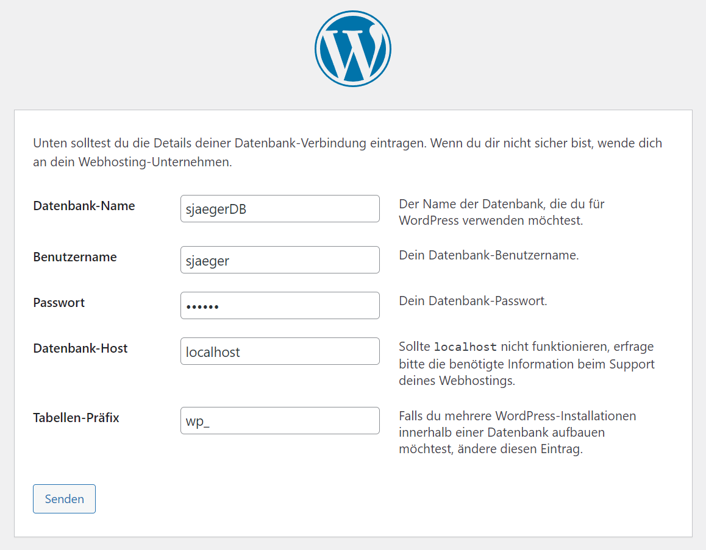

# WordPress

[WordPress](https://wordpress.org/) ist ein Content Management System (CMS), das die Erstellung und
Verwaltung eines Blogs vereinfacht. Navigiere auf deine WDD-Domain, um die
Installation zu starten.

