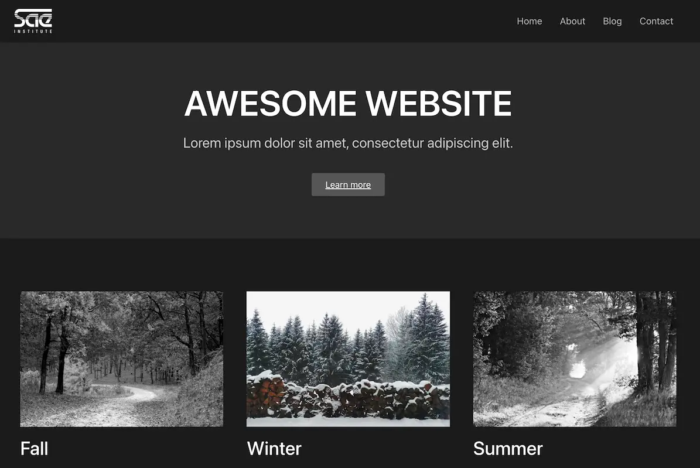

# sae cm

websites mit wordpress (5 * 6h)

- [canvas](https://canvas.sae.edu/courses/20032/assignments)
- [sae blog](https://projekte.sae.ch)
- [zugangsdaten ftp/db](https://docs.google.com/spreadsheets/d/1AbsW0GSadwPqMTr3f30889b4nDQ3nE7zy9SqwPE9KSA/edit#gid=178496325)

https://cd-000-simonj.mywdd.info

## outline

- T: introductions
- wordpress
- ftp and filezilla 
- upload
- installation
- overview
- T: https://wordpress.org/documentation/article/introduction-to-blogging/
- T: https://wordpress.org/documentation/article/get-started-with-wordpress/
- ........................................
- pages
- settings
- plugins (duplicate page)
- themes (twenty twenty, kubio, jadro, zeever, hello elementor, ...)
- ........................................
- elementor
- elementor: plugin settings (disable default colors and fonts, feature: grid container, feature: editor top bar)
- elementor: theme settings (hide title)
- widgets: heading, paragraph, image, button, links, ...
- styling: color, typography, ...
- box model: width, height, border, margin, padding, ...
- T: create a simple about page
- ........................................
- media
- alt texts
- image optimization (2000px max, webp squoosh)
- free assets (pexels, undraw, remixicon)
- T: upload a few optimized images and add alt texts
- ........................................
- site settings: theme styles
- customizer: identity, homepage
- T: customize your theme styles
- ........................................
- sae canvas
- T: read canvas assignemnts and start
- ........................................
- menus
- site settings: hello theme header and footer
- T: create a menu for your header
- T: customize your header and footer
- ........................................
- containers
- flexbox
- grid
- T: create a fancy homepage
- ........................................
- decorations: border radius and shadow, transform, gradients, overlays, filters, ...
- hover effects (color change etc.)
- motion/scroll effects (fade in etc.)
- T: improve your site with decorations and effects
- ........................................
- posts
- comments
- categories
- indexes (/category/foobar)
- custom indexes (ultimate post kit)
- T: create a few blog posts
- T: create a custom blog index
- ........................................
- seo: title, desc, ... (autodescription plugin)
- R: https://developers.google.com/search/docs/fundamentals/seo-starter-guide
- T: optimize your blog posts for seo
- ........................................
- responsive design (desktop, tablet, mobile)
- T: make your site responsive
- ........................................
- contact forms (metform)
- T: create a contact page
- ........................................
- backups and transfers (updraft plus)
- T: create a backup of your site
- ........................................
- advanced widgets: carousel, toggle, etc.
- shortcodes
- T: use advanced widgets
- T: use shortcodes
- ........................................
- html widget (iframe, snippet, ...)
- custom widget css (css plugin)
- custom widget html (unlimited elements plugin)
- T: add custom code (html, css, widgets, ...)
- ........................................
- T: work on your site

## tools

- https://www.google.com/chrome/
- https://filezilla-project.org/download.php?type=client
- https://wordpress.org/download/
- https://squoosh.app/
- https://localwp.com/
- https://apps.apple.com/app/id1545870783 (color picker)

## themes and plugins

- https://wordpress.org/themes/hello-elementor/
- https://wordpress.org/plugins/duplicate-page/
- https://wordpress.org/plugins/autodescription/
- https://wordpress.org/plugins/elementor/
- https://wordpress.org/plugins/unlimited-elements-for-elementor/
- https://wordpress.org/plugins/ultimate-post-kit/
- https://wordpress.org/plugins/metform/
- https://wordpress.org/plugins/custom-css-for-elementor/
- https://wordpress.org/plugins/custom-fonts/
- https://wordpress.org/plugins/menu-image/
- https://wordpress.org/plugins/header-footer-elementor/
- https://wordpress.org/plugins/updraftplus/

## docs and guides

- https://learn.wordpress.org/tutorials/
- https://www.wpbeginner.com/
- https://elementor.com/academy/get-started/

## screenshot

